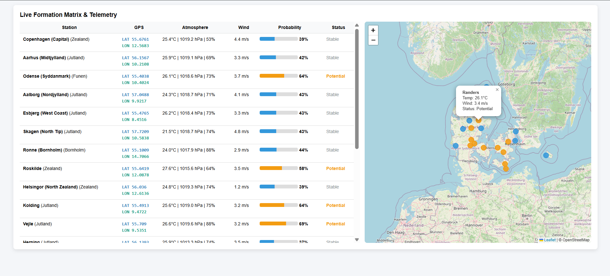

# Weather Station Dashboard (Flask + Open-Meteo)

## Overview
This project is a real-time weather dashboard built with Python and Flask. It fetches live weather data from the Open-Meteo API and displays it in a table-based web interface.

## Technologies Used

### Programming Language
- Python 3.10+ (recommended: Python 3.11)

### Libraries / Dependencies

| Library | Type | Purpose |
|--------|------|--------|
| Flask (3.x) | External | Web framework |
| urllib | Standard Library | HTTP requests |
| json | Standard Library | JSON parsing |
| ssl | Standard Library | Secure HTTPS connections |
| threading | Standard Library | Background processing |
| time | Standard Library | Scheduling / timestamps |

## Installation

### Install Python
Download Python 3.11:
https://www.python.org/downloads/

Check installation:
python --version

### Create virtual environment
python -m venv .venv

Activate environment:

Windows:
.venv\Scripts\activate

macOS/Linux:
source .venv/bin/activate

### Install dependencies
pip install flask

## Project Structure

<pre>
```text
PythonProject/
│
├── src/
│   ├── app.py
│   ├── stations.py
│   ├── configer.py
│
├── templates/
│   └── index.html
│
├── run.py
└── README.md

</pre>

## How to Run the Project

### 1. Activate virtual environment

Windows:
.venv\Scripts\activate

macOS/Linux:
source .venv/bin/activate

---

### 2. Install dependencies (if not already installed)

pip install flask

---

### 3. Start the application

python run.py

---

### 4. Open in browser

http://127.0.0.1:5000

### 5. Application Preview



*Dashboard view showing live weather telemetry, cloud formation probability, station status, and an interactive Denmark map.*