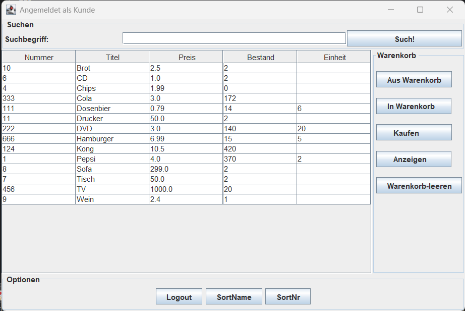
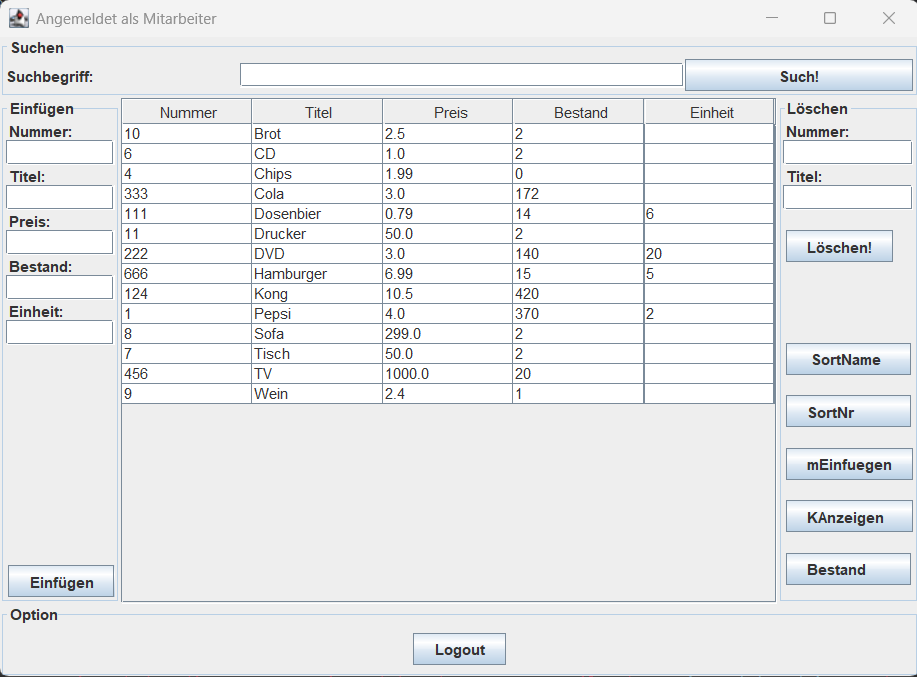
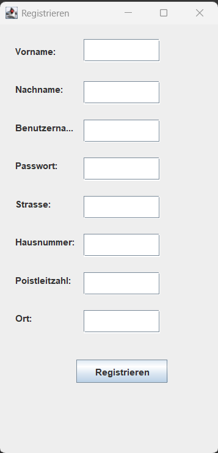
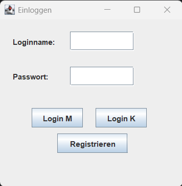

# OnlineShop

Dieses Projekt ist ein in **Java** entwickelter Online-Shop. Die Anwendung ist nach einer **3-Schichten-Architektur** aufgebaut und trennt Benutzeroberfläche, Logik und Datenhaltung voneinander.

## Architektur

Das Projekt verwendet eine klassische **3-Schichten-Architektur**:

### 1. Präsentationsschicht / UI
Die Benutzeroberfläche befindet sich im Paket:

`shop.local.ui`

Es gibt sowohl eine Konsolenoberfläche als auch eine grafische Oberfläche:

- `cui` – Konsolenbasierte Benutzeroberfläche
- `gui` – Grafische Benutzeroberfläche mit Java Swing

### 2. Logikschicht / Domain
Die Logik befindet sich im Paket:

`shop.local.domain`

Diese Schicht enthält unter anderem die Verwaltung von:

- Artikeln
- Kunden
- Mitarbeitern
- Warenkorb
- Ereignissen
- Login-Funktionen

### 3. Persistenzschicht
Die Datenhaltung befindet sich im Paket:

`shop.local.persistence`

Hier werden Daten über Dateien gespeichert und geladen. Dafür werden unter anderem Textdateien wie `shop_K.txt`, `shop_M.txt` und `shop_P.txt` verwendet.

#### Austauschbarkeit der Persistenz

Die Anwendung wurde nach dem Prinzip der 3-Schichten-Architektur entwickelt, um eine klare Trennung zwischen Benutzeroberfläche, Logik und Datenhaltung zu gewährleisten.

Ein wesentlicher Vorteil dieser Architektur besteht darin, dass die Persistenzschicht unabhängig von den anderen Schichten ausgetauscht werden kann. Aktuell erfolgt die Speicherung der Daten dateibasiert über Textdateien. Die Anwendung kann jedoch ohne größere Änderungen an der Benutzeroberfläche oder der Geschäftslogik auf eine Datenbanklösung umgestellt werden.

Mögliche Datenbanksysteme wären beispielsweise:

- MySQL
- PostgreSQL
- MariaDB
- SQLite

Durch die Trennung der Schichten müssen bei einem Wechsel der Speichertechnologie lediglich die Klassen der Persistenzschicht angepasst oder ersetzt werden. Die Präsentationsschicht sowie die Domänenschicht bleiben dabei unverändert.

## Programmiersprache

Das Projekt wurde vollständig in **Java** geschrieben.

## Verwendete Bibliotheken und Technologien

Es werden hauptsächlich Standardbibliotheken von Java verwendet:

- **Java Swing** für die grafische Benutzeroberfläche
- **Java AWT** für Layouts und Events
- **Java IO** für Dateioperationen
- **Java Collections** für Listen, Maps und Datenstrukturen
- **Java Time API** für Datum und Zeit
- Eigene Exceptions zur Fehlerbehandlung

Es werden keine externen Frameworks verwendet.


                       
            
            
## Benutzeroberfläche

Die Anwendung verfügt über eine grafische Benutzeroberfläche, die die Anmeldung, Registrierung und Nutzung des Online-Shops ermöglicht.

### Kundenanmeldung



Über dieses Fenster können sich registrierte Kunden am System anmelden.

### Mitarbeiteranmeldung



Mitarbeiter können sich über eine separate Anmeldemaske anmelden und auf die Verwaltungsfunktionen des Systems zugreifen.

### Registrierung



Neue Kunden können über das Registrierungsformular einen Benutzeraccount erstellen.

### Hauptansicht nach erfolgreicher Anmeldung



Nach erfolgreicher Anmeldung erhält der Benutzer Zugriff auf die Funktionen des Online-Shops.  

## Projektstruktur

```text
src/
└── shop/
    └── local/
        ├── domain/
        │   ├── Logik
        │   └── exceptions/
        ├── persistence/
        │   └── Dateibasierte Datenhaltung
        ├── ui/
        │   ├── cui/
        │   └── gui/
        └── valueObjects/
            └── Datenklassen wie Artikel, Kunde, Mitarbeiter, Warenkorb
```           