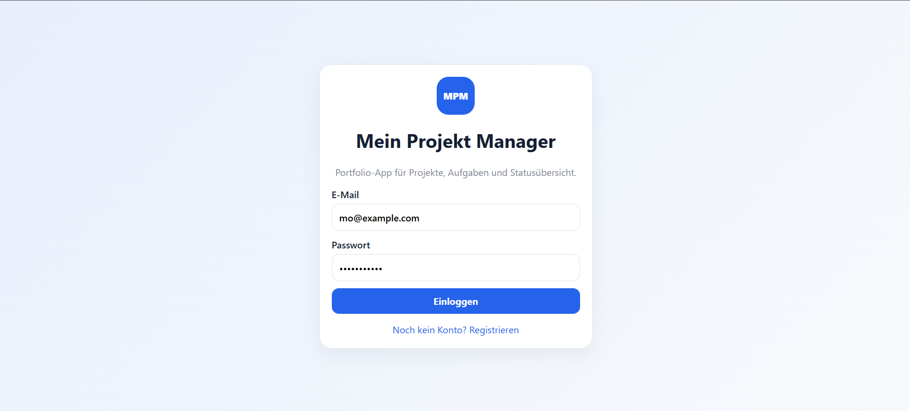
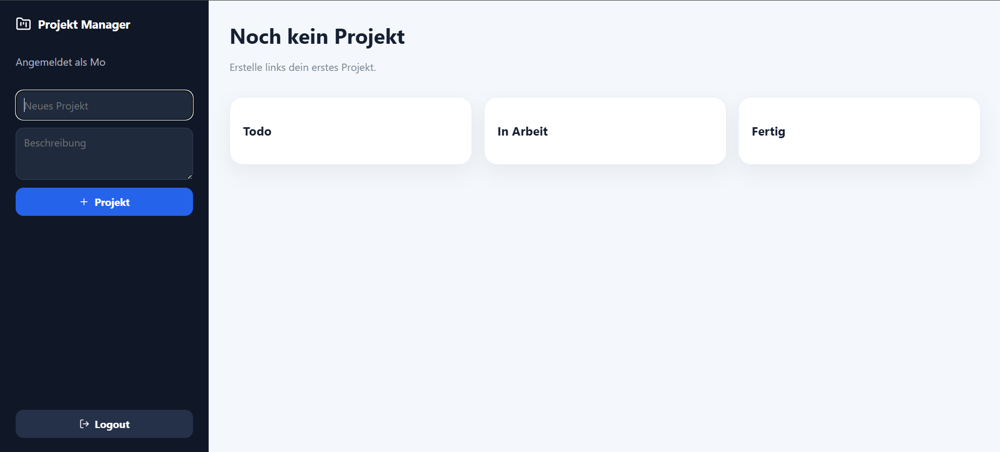

# Mein Projekt Manager

Ein Full-Stack-Projektmanagement-Tool zur Verwaltung von Projekten und Aufgaben.

Die Anwendung wurde als Portfolio-Projekt entwickelt und demonstriert die Umsetzung einer modernen Webanwendung mit React, Node.js, Express und einer REST-API.

---

## Projektübersicht

Die Anwendung bietet folgende Funktionen:

### Benutzerverwaltung

- Benutzerregistrierung
- Benutzeranmeldung
- JWT-basierte Authentifizierung
- Geschützte API-Endpunkte

### Projektverwaltung

- Projekte erstellen
- Projekte bearbeiten
- Projekte löschen
- Projektübersicht anzeigen

### Aufgabenverwaltung

- Aufgaben erstellen
- Aufgaben bearbeiten
- Aufgaben löschen
- Prioritäten verwalten
- Fälligkeitsdaten festlegen
- Aufgabenstatus verwalten:
  - Todo
  - In Arbeit
  - Fertig

### Technische Funktionen

- REST API
- Client-Server-Architektur
- Persistente Datenspeicherung
- Automatisierte Tests
- Continuous Integration mit GitHub Actions

---

## Verwendete Technologien

### Programmiersprachen

- JavaScript (ES6+)
- HTML5
- CSS3

### Frontend

- React
- Vite
- Axios
- React Router

### Backend

- Node.js
- Express.js
- JSON Web Token (JWT)
- bcryptjs

### Testing

- Node Test Runner
- Supertest

---

## Architektur

Die Anwendung besteht aus einem Frontend und einem Backend, die über eine REST-Schnittstelle miteinander kommunizieren.

```text
Frontend (React)
        │
        ▼
Backend (Express REST API)
        │
        ▼
Dateibasierte Datenspeicherung
```

Die Architektur ermöglicht eine spätere Migration auf relationale Datenbanken wie PostgreSQL oder MySQL ohne größere Änderungen an der Frontend-Anwendung.

---

## Projektstruktur

```text
mein-projekt-manager/
│
├── backend/
│   ├── src/
│   │   ├── config/
│   │   ├── controllers/
│   │   ├── models/
│   │   ├── routes/
│   │   ├── middlewares/
│   │   └── server.js
│   │
│   ├── data/
│   │   └── database.json
│   │
│   ├── tests/
│   ├── package.json
│   └── Dockerfile
│
├── frontend/
│   ├── src/
│   │   ├── components/
│   │   ├── pages/
│   │   ├── services/
│   │   ├── context/
│   │   ├── hooks/
│   │   └── App.jsx
│   │
│   ├── package.json
│   └── Dockerfile
│
├── .github/
│   └── workflows/
│       └── ci.yml
│
├── package.json
└── README.md
```

---

## Datenhaltung

Die Anwendung verwendet bewusst eine lokale JSON-Datenbank.

```text
backend/data/database.json
```

Dadurch kann das Projekt ohne zusätzliche Datenbankinstallation gestartet werden und eignet sich besonders für Demonstrationszwecke.

---

## Installation

### Voraussetzungen

- Node.js 24 oder neuer
- npm

Versionen prüfen:

```powershell
node -v
npm -v
```

---

## Abhängigkeiten installieren

```powershell
npm install
npm run install:all
```

---

## Anwendung starten

```powershell
npm run dev
```

---

## Anwendung aufrufen

Frontend:

```text
http://localhost:5173
```

Backend:

```text
http://localhost:5000/api/health
```

---

## Testkonto

Es kann direkt über die Benutzeroberfläche ein neues Benutzerkonto erstellt werden.

Beispiel:

```text
Name: Demo User
E-Mail: demo@example.com
Passwort: password123
```

---

## API-Endpunkte

### Health Check

```http
GET /api/health
```

### Authentifizierung

```http
POST /api/auth/register
POST /api/auth/login
GET  /api/auth/me
```

### Projekte

```http
GET    /api/projects
POST   /api/projects
PATCH  /api/projects/:id
DELETE /api/projects/:id
```

### Aufgaben

```http
GET    /api/tasks
POST   /api/tasks
PATCH  /api/tasks/:id
DELETE /api/tasks/:id
```

---

## Tests

Backend-Tests ausführen:

```powershell
cd backend
npm test
```

oder im Hauptverzeichnis:

```powershell
npm test
```

---

## Erweiterungsmöglichkeiten

- Kanban Board mit Drag-and-Drop
- Rollen- und Rechtesystem
- Teamverwaltung
- Dateiuploads
- Kommentarfunktion
- PostgreSQL Integration
- Docker Deployment
- OpenAPI / Swagger Dokumentation
- End-to-End-Tests mit Playwright
- Cloud Deployment

---

## Screenshots

### Login



### Dashboard

